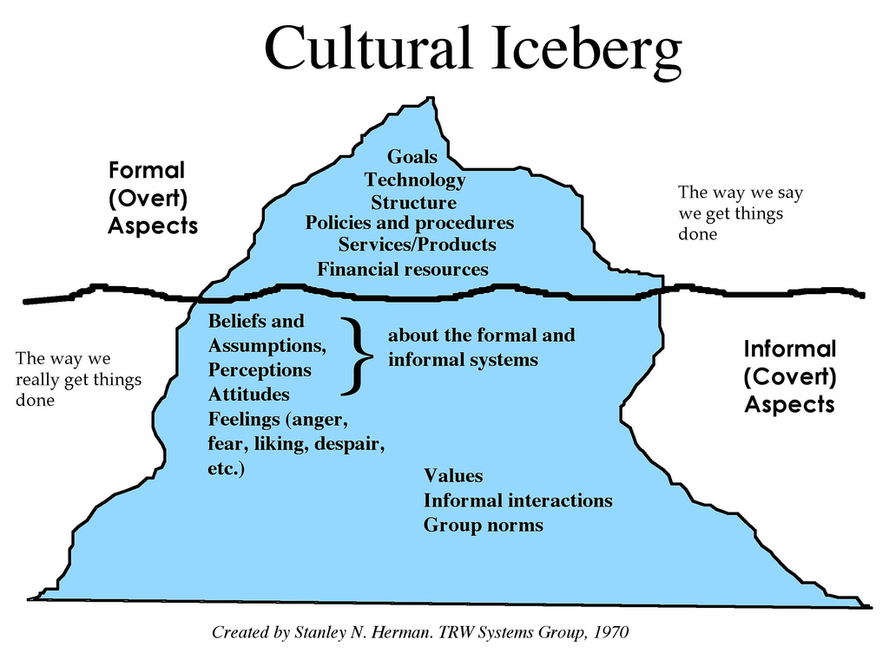
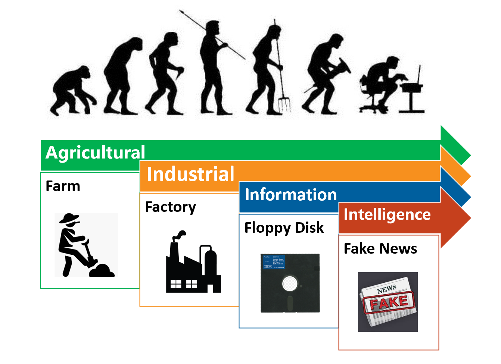

## 5. Define Culture and its Influence on Healthcare System

### 5.1 What is Culture

- "the way of life, especially the general customs and beliefs, of a particular group of people at a particular time" - Cambridge Dictionary
- "the customary beliefs, social forms, and material traits of a racial, religious, or social group.
also : the characteristic features of everyday existence (such as diversions or a way of life) shared by people in a place or time" - Merriam Webster
- "Simply said, culture is how you were raised. It developed while you grew up. With a computer metaphor, culture is the software of our minds. We need shared software in order to communicate. So culture is about what we share with those around us. In action in social life, culture constitutes the unwritten rules of the social game." - Hofstede.

### 5.2 Edward T. Hall's Iceburg Model of Culture

### 5.3 Hofstede's 6D Model of National Culture

1. Power Distance Index (PDI)
2. Individualism vs Collectivism (IDV)
3. Masculinity vs Femininity (MAS)
4. Uncertainty Avoidance Index (UAI)
5. Long-Term Orientation (LTO) vs Short-Term Orientation (STO)
6. Indulgence vs Restraint (IVR)

### 5.4 References

- [Culturally Conscious](http://culture.pythonanywhere.com/)
- [Define Culture](https://geerthofstede.com/culture-geert-hofstede-gert-jan-hofstede/definition-culture/)
- [Six Dimensional Model of National Culture](https://geerthofstede.com/culture-geert-hofstede-gert-jan-hofstede/6d-model-of-national-culture/)

### 5.4 How National Culture influence Selection and Outcomes of Healthcare System

- Chapter 2 - Beliefs, Values, and Health
- Anthro-Cultural Beliefs and Values (Page 72-79)

## "The Third Wave" By Alvin Toffler
- The first wave/age/era - Agricultural 
- The second wave/age/era - Industrial 
- The third wave/age/era - Information

https://en.wikipedia.org/wiki/The_Third_Wave_(Toffler_book)
