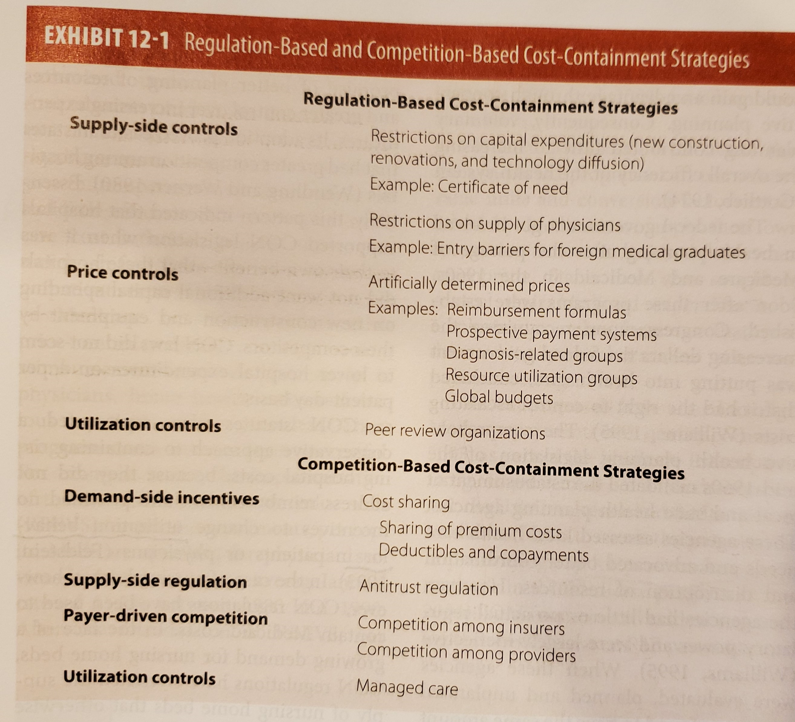
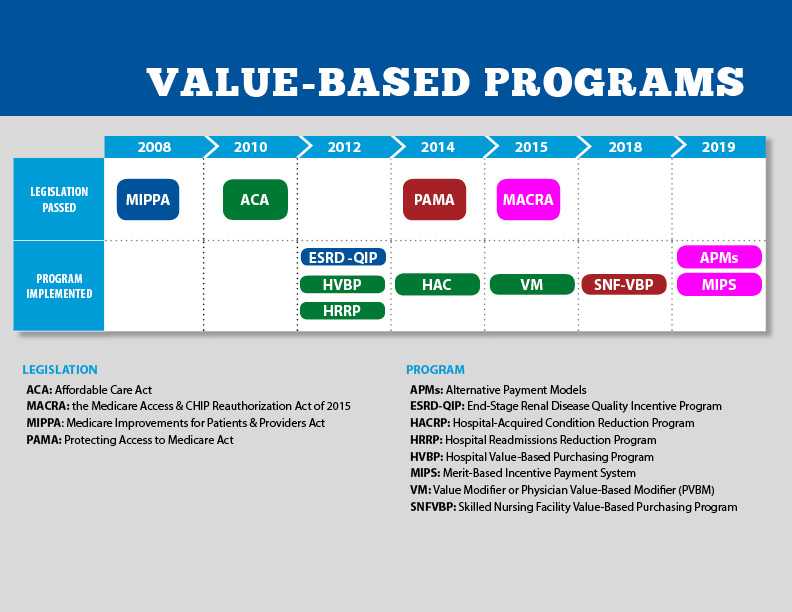

# Cost, Access, and Quality
- Iron Triangle of Healthcare

- Compare with Project Management Triple Constraints

## 1. Costs
### 1.1 Levels of Costs
- Macro level: 
    - National Health Expenditure (NHE) 
    - NHE as % Gross Domestic Products (GDP) 
    - Compare growth rate of NHE vs Growth rate of GDP
- Micro level:
    - Employers (paying for insurance premium and cost of care)
    - Providers (cost of providing healthcare)
    - Patients (paying for insurance premium, copayment, and deductibles)
### 1.2 Reasons for high healthcare cost
- Demand-side
    - People live longer and unhealthier lives
    - Increased access to healthcare
- Supply-side
    - cost of technology development (HIT, biomedical)
    - adoption of technology-> overuse
    - Defensive medicine -> overuse
    - Administrative cost (insurance, third-party payment)
- Other
    - Markey inefficiency (imperferct market)
    - Regulatory burden
    - Waste
    - Fraud
    - Abuse   
### 1.3 Approaches to Contain Costs

### 1.4 Address Root Causes of Health 
- Prevention vs Intervention 
- Social determinants of health

## 2. Access
### Access to Care Framework

## 3. Quality
### 3.1 Donabedian Model of Healthcare Quality

### 3.2 Improve Quality of Care
Use People-Process-Technology 
- People (providers)
    - Training
    - Care for the whole person, not just medical care (four dimensions of health)
- Process
    - Care coordination
    - Patient adherence 
    - Community support
- Technology
    - Health Information Technology
    - Biomedical Technology
### 3.3 CMS Medicare Value-Based Purchasing (VBP) Programs 
This is considered as Regulatory and policy approaches to improve quality of care with the strategy
of paying for quality not quantity, aka "Pay for Performance" (P4P). 

Questions remain about its effect on quality and also its potential unintended adverse consequence such as:
- Decreased access to care
- Increased disparities in care
- impedements to innovation

### 3.4 ESRD Quality Incentive Program (QIP) 
- Measures of quality and perform scores established overtime
- Up to 2% penality in payment
- Dialysis Compare 
- Public Use files (PUF)
